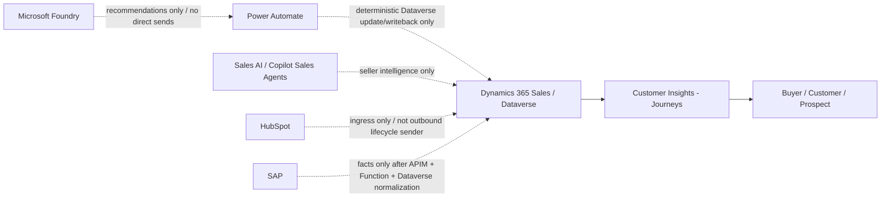

---
"Agentic Sales Orchestrator — Phase 3 Customer Insights - Journeys End-to-End Key User Runbook"
"Enterprise customer-facing implementation and training lab guide"
"2026-06-11"
---

# Document control

| Item | Value |
| --- | --- |
| Document purpose | Customer-facing key-user build runbook for Phase 3 Customer Insights - Journeys. |
| Document version | Rev3 — updated for actual ASO MVP/demo build validation. |
| Primary audience | Customer project team, Marketing Operations, Sales Operations, CRM architects, Power Platform owners, key users. |
| Applies to | Dynamics 365 Customer Engagement online environments, Dataverse environments, and Customer Insights - Journeys. |
| Scope | ASO.Journeys solution, Customer Insights availability, authenticated sender domain, compliance profile, Dataverse readiness fields, triggers, real-time segments, reusable email templates, actual EML email assets, actual journeys, optional journey templates, writeback requirements, workbook/registers, TEST-ASO safety controls, validation, demo readiness, and customer handover. |
| Core rule | Customer Insights - Journeys is the only outbound lifecycle customer communication execution layer. |
| Build principle | Document only what has been configured or what the key user must configure next. Use test-safe records until validation is complete. |


# Contents

1. Purpose and scope  
2. Step 1 — Create or confirm the ASO.Journeys solution  
3. Step 2 — Confirm Customer Insights - Journeys availability  
4. Step 3 — Configure and verify sending domain readiness  
5. Step 4 — Configure compliance profile, purpose, and topics  
6. Step 5 — Trigger configuration — as built  
7. Step 6 — Customer Insights - Journeys real-time segments  
8. Step 7 — Email template and actual EML email asset configuration  
9. Step 8 — Journey configuration  
10. Step 9 — Customer Insights writeback requirements  
11. Step 10 — Update the implementation workbook and registers  
12. Customer-ready validation and demo readiness checklist  
13. Common mistakes to avoid  
14. Expected outcome and customer handover  
15. Immediate key-user build sequence  
16. Architecture boundary snapshot  
17. Appendix A — Field glossary for key users  
18. Appendix B — Key-user training lab script  


# 1. Purpose and scope

This document is the Phase 3 Customer Insights - Journeys build runbook for Agentic Sales Orchestrator (ASO). Customer Insights - Journeys is the outbound lifecycle communication execution layer. Dataverse/Dynamics 365 Sales holds lifecycle communication state, consent state, journey participation state, and approved communication request fields.

The guide is written so that a key user can reproduce the build without knowing the full project history. It covers the end-to-end communication-plane setup: solution shell, app availability, domain readiness, compliance, triggers, segments, email assets, journeys, writeback requirements, workbook controls, validation, and handover.

## 1.1 ASO communication boundary

| Component | Role in Phase 3 |
|---|---|
| Customer Insights - Journeys | Sends approved lifecycle customer communications. |
| Dynamics 365 Sales / Dataverse | Stores lifecycle stage, communication state, consent state, journey participation status, and approved communication request fields. |
| Power Automate | May update Dataverse state and later perform deterministic writeback. It must not send lifecycle customer communications. |
| Microsoft Foundry / Sales AI agents | May recommend or prepare actions. They must not send lifecycle customer communications. |
| SAP | Supplies commercial facts only after governed integration and Dataverse normalization. |
| HubSpot | Ingress-only and not part of Phase 3 outbound communication execution. |

## 1.2 What must already be true from earlier phases

- `ASO.Core`, `ASO.Automation`, and `ASO.Operations` exist.
- The ASO publisher uses prefix `aso`.
- Environment variables exist for journey keys and compliance profile name.
- Dataverse schema includes communication state, lifecycle stage, journey participation, consent, journey ID/name, last interaction, and communication hold fields.
- Test records are clearly separated from real records by `TEST-ASO` naming.

## 1.3 Non-negotiable build rules

- Do not send lifecycle customer emails from Outlook, Power Automate, Foundry, Sales AI agents, SAP, or HubSpot.
- Do not treat segment membership as consent proof. Consent must be explicitly represented and validated.
- Do not include raw SAP facts in email content. Use only SAP-derived facts persisted or summarized in Dataverse.
- Do not use unmanaged AI-generated copy in customer-facing messages. Draft text must be reviewed and approved.
- Do not publish the Order Confirmation journey or send Order Confirmation email until SAP Order Reference validation is complete.

## 1.4 Correct ASO build sequence and asset relationships

The ASO MVP/demo build follows this sequence:

1. Extend Dataverse fields.
2. Create Customer Insights - Journeys triggers.
3. Create real-time segments.
4. Create reusable email templates.
5. Create actual EML email assets from those templates.
6. Create actual journeys using the actual EML email assets.
7. Publish only for TEST-ASO demo-safe records.
8. Save journey templates later if required.

The difference between templates, email assets, and journeys is deliberate:

| Item | What it is | How ASO uses it |
| --- | --- | --- |
| Email template | Reusable design and content asset. | Used as the starting point for creating actual emails. |
| Actual EML email asset | The sendable email record in Customer Insights - Journeys. | Selected on journey email tiles and used by journeys. |
| Journey | The configured orchestration flow. | Starts from a real-time segment, sends the actual EML email asset, and exits or branches as designed. |
| Journey template | Optional reusable starting point created from a validated actual journey. | Created later by clicking **Save as Template** after the actual journey is working. |

Create actual journey first. Validate it. Publish it only for TEST-ASO safe records if needed for the demo. Then optionally click **Save as Template** to create the reusable journey template.
# 2. Step 1 — Create or confirm the ASO.Journeys solution

Use this step to create or verify the solution container used for Customer Insights - Journeys configuration references and ALM-supported journey components.

## 2.1 Navigation

`make.powerapps.com → correct environment → Solutions → New solution`

## 2.2 Click-by-click

1. Open `make.powerapps.com`.
2. Select the ASO Dev environment.
3. Select **Solutions**.
4. Select **New solution**.
5. Enter the fields below.
6. Select **Create**.
7. Open the solution and confirm it appears in the solution list.
8. Record the solution in the implementation workbook.

## 2.3 Field-by-field


| Field | Value to enter |
| --- | --- |
| Display name | ASO.Journeys |
| Name | ASO.Journeys |
| Publisher | Agentic Sales Orchestrator |
| Publisher prefix | aso |
| Version | 0.1.0 |
| Purpose | Customer Insights triggers, journey configuration references, segment notes, email asset inventory, and ALM-supported journey components where available. |


## 2.4 Validation

- Confirm the solution is not the Dataverse default solution.
- Confirm the publisher is the ASO publisher.
- Confirm the key user can open the solution and add configuration records where supported.


# 3. Step 2 — Confirm Customer Insights - Journeys availability

Use this step to confirm that Customer Insights - Journeys is installed and available in the ASO environment used for the communication plane.

## 3.1 Navigation

`Power Platform admin center → Environments → selected environment → Resources → Dynamics 365 apps`

## 3.2 Click-by-click

1. Open the **Power Platform admin center**.
2. Select the ASO environment.
3. Select **Resources**.
4. Select **Dynamics 365 apps**.
5. Search for **Dynamics 365 Customer Insights - Journeys**.
6. Confirm the app is installed in the ASO environment.
7. Open the app launcher.
8. Open **Customer Insights - Journeys**.
9. Confirm that the app opens in the correct environment.
10. Record the result in the workbook.

## 3.3 Readiness register fields

| Field | Value to record |
| --- | --- |
| Customer Insights installed | Yes |
| Environment | ASO Dev environment name |
| App URL | Customer Insights - Journeys app URL |
| License status | Confirmed / Trial / Pending / Blocked |
| Owner | Marketing Operations / Platform Admin / named owner |
| Notes | Confirmation notes or installation blocker owned by the platform team |

## 3.4 Validation

- The app opens successfully for the key user.
- The key user is in the correct ASO environment.
- Customer Insights - Journeys appears in the app list.
- No alternate send mechanism is created when the app is unavailable.

# 4. Step 3 — Configure and verify sending domain readiness

Use this step to verify the authenticated sender domain used by ASO lifecycle emails. The root domain **phoenicarix.com** is authenticated because the working sender mailbox is **vlad.zaicescu@phoenicarix.com**. This resolved the sender-domain validation warning.

## 4.1 Navigation

`Customer Insights - Journeys → Settings → Email marketing → Domain authentication`

## 4.2 Click-by-click verification

1. Open **Customer Insights - Journeys**.
2. Select **Settings**.
3. Open **Email marketing**.
4. Select **Domain authentication**.
5. Open the authenticated domain:
   **phoenicarix.com**
6. Confirm **Status** = **Confirmed / Verified**.
7. Confirm **Email sending** = **Enabled**.
8. Confirm the verification items show as validated:
   - Ownership key
   - DNS CNAME 1
   - DNS CNAME 2
   - Envelope-from
9. Confirm **mvp.phoenicarix.com** remains active and was not deleted.
10. Record the domain and sender validation in the workbook.

## 4.3 Domain readiness record

| Field | Value |
| --- | --- |
| Root sending domain | phoenicarix.com |
| Domain status | Confirmed / Verified |
| Email sending | Enabled |
| Ownership key | Verified |
| DNS CNAME 1 | Verified |
| DNS CNAME 2 | Verified |
| Envelope-from | Verified |
| Related domain | mvp.phoenicarix.com remains active and was not deleted |
| Reason for root domain authentication | The working sender mailbox is vlad.zaicescu@phoenicarix.com. |

## 4.4 Sender used for ASO MVP/demo emails

| Field | Value |
| --- | --- |
| From name | Phöenicarix Sales Team |
| From email | vlad.zaicescu@phoenicarix.com |
| Reply-to | vlad.zaicescu@phoenicarix.com |
| Sending rule | Use this sender only after the root sender domain warning is resolved. |
| Demo safety | Send only to TEST-ASO demo-safe records during validation. |

## 4.5 Validation

- **phoenicarix.com** is verified.
- Email sending is enabled.
- Sender-domain warning is resolved.
- The sender is **Phöenicarix Sales Team <vlad.zaicescu@phoenicarix.com>**.
- **mvp.phoenicarix.com** remains active.
- Test sends are limited to TEST-ASO or approved internal recipient records.

# 5. Step 4 — Configure compliance profile, purpose, and topics

Use this step to create the compliance structure used by every ASO lifecycle email.

## 5.1 Navigation

`Customer Insights - Journeys → Settings → Customer engagement → Compliance profiles`

## 5.2 Click-by-click

1. Open **Customer Insights - Journeys**.
2. Select **Settings**.
3. Open **Customer engagement**.
4. Select **Compliance profiles**.
5. Select **New**.
6. Name the profile **Global Commercial**.
7. Select the approved preference center.
8. Add the approved company address.
9. Configure unsubscribe behavior.
10. Create the purpose **Sales Lifecycle**.
11. Create each topic listed below.
12. Publish the compliance profile.
13. Open the preference center link and test that it renders correctly.
14. Record the profile, purpose, topics, and preference center status in the workbook.

## 5.3 Field-by-field


| Field | Value |
| --- | --- |
| Compliance profile | Global Commercial |
| Purpose | Sales Lifecycle |
| Preference center | Use the approved Customer Insights preference center |
| Company address | Use the approved company address from customer compliance settings |
| Unsubscribe behavior | Configured and tested before any live send |
| Publishing action | Publish after validation |


## 5.4 Topics to create


| Topic name |
| --- |
| Lead |
| Qualified Lead |
| Opportunity |
| Quote Proposal |
| Order |
| Onboarding |
| Retention |
| Expansion |


## 5.5 Validation

- `Global Commercial` is published.
- `Sales Lifecycle` purpose exists.
- All eight topics exist.
- Preference center opens successfully.
- Each email asset uses the correct topic.

# 6. Step 5 — Trigger configuration — as built

Use this section to verify or reproduce only the Customer Insights - Journeys trigger fields that were actually configured for ASO. The triggers are created in Customer Insights - Journeys and reference Dataverse tables. Opportunity-based triggers use the Opportunity contact lookup as the participant/contact relationship.

## 6.1 Navigation

`Customer Insights - Journeys → Engagement → Triggers → New trigger`

## 6.2 Dataverse readiness and trigger-support fields

These fields are the ASO communication-plane fields that support trigger readiness, segment membership, and safe journey execution.

| Dataverse field | Purpose in ASO build | Used by |
| --- | --- | --- |
| Lifecycle Communication Stage | Identifies the lifecycle stage for communication readiness. | Triggers, segments, journeys, workbook validation |
| Communication State | Holds communication eligibility or suppression state. | Triggers, segments, suppression controls |
| Journey Participation Status | Prevents overlapping active journey participation. | Triggers, segments, re-entry controls |
| Email Consent Status | Confirms opt-in, opt-out, or blocked state. | Triggers, segments, compliance validation |
| Lead Nurture Communication Requested | Marks the Lead Nurture communication request. | Lead communication readiness |
| Qualified Lead Follow Up Communication Requested | Marks the Qualified Lead Follow Up communication request. | Qualified lead communication readiness |
| Opportunity Progression Communication Requested | Marks the Opportunity Progression communication request. | Opportunity communication readiness |
| Quote Proposal Communication Requested | Marks the Quote Proposal communication request. | Quote Proposal trigger and segment readiness |
| Order Confirmation Communication Requested | Marks the Order Confirmation communication request. | Order Confirmation trigger readiness |
| Onboarding Communication Requested | Marks the Onboarding communication request. | Onboarding trigger readiness |
| Quote Proposal URL | Stores the approved proposal URL when it is governed for use. | Quote Proposal communication data |
| SAP Order Reference | Stores the SAP order reference required before live order communication. | Order Confirmation validation |
| Onboarding Readiness Confirmed | Confirms onboarding is ready before onboarding communication. | Onboarding trigger readiness |

## 6.3 General click-by-click

1. Open **Customer Insights - Journeys**.
2. Go to **Engagement → Triggers**.
3. Select **New trigger**.
4. Enter the trigger name exactly as listed.
5. Select the Dataverse table from the trigger register.
6. Select the audience from the trigger register.
7. Select the audience attribute from the trigger register.
8. For **When is the trigger activated?**, select **An existing record was updated**.
9. Select only the listed trigger activation fields for that trigger.
10. Save the trigger.
11. Select **Ready to use**.
12. Record the trigger in the workbook.

## 6.4 Trigger register

| Trigger name | Table | Audience | Audience attribute | Trigger activation fields | Status |
| --- | --- | --- | --- | --- | --- |
| ASO Lead Nurture Requested | Lead | Lead | Lead (via self) | Lifecycle Communication Stage; Communication State; Journey Participation Status; Email Consent Status | Ready to use |
| ASO Qualified Lead Follow Up Requested | Contact | Contact | Contact (via self) | Lifecycle Communication Stage; Communication State; Journey Participation Status; Email Consent Status | Ready to use |
| ASO Opportunity Progression Requested | Opportunity | Contact | Contact (parentcontactid) | Lifecycle Communication Stage; Communication State; Journey Participation Status; Email Consent Status | Ready to use |
| ASO Quote Proposal Requested | Opportunity | Contact | Contact (parentcontactid) | Quote Proposal Communication Requested; Lifecycle Communication Stage; Communication State; Journey Participation Status; Email Consent Status | Ready to use |
| ASO Order Confirmation Requested | Opportunity | Contact | Contact (parentcontactid) | Order Confirmation Communication Requested; SAP Order Reference; Lifecycle Communication Stage; Communication State; Email Consent Status | Ready to use |
| ASO Onboarding Requested | Opportunity | Contact | Contact (parentcontactid) | Onboarding Readiness Confirmed; Onboarding Communication Requested; Lifecycle Communication Stage; Communication State; Journey Participation Status; Email Consent Status | Ready to use |

## 6.5 ASO Lead Nurture Requested

| Field | Value |
| --- | --- |
| Trigger name | ASO Lead Nurture Requested |
| Table | Lead |
| Audience | Lead |
| Audience attribute | Lead (via self) |
| When activated | An existing record was updated |
| Trigger activation fields | Lifecycle Communication Stage; Communication State; Journey Participation Status; Email Consent Status |
| Status | Ready to use |

**Screen-by-screen verification**

1. Open **ASO Lead Nurture Requested**.
2. Confirm **Table** = **Lead**.
3. Confirm **Audience** = **Lead**.
4. Confirm **Audience attribute** = **Lead (via self)**.
5. Confirm **When activated** = **An existing record was updated**.
6. Confirm **Trigger activation fields** = Lifecycle Communication Stage; Communication State; Journey Participation Status; Email Consent Status.
7. Confirm **Status** = **Ready to use**.

## 6.6 ASO Qualified Lead Follow Up Requested

| Field | Value |
| --- | --- |
| Trigger name | ASO Qualified Lead Follow Up Requested |
| Table | Contact |
| Audience | Contact |
| Audience attribute | Contact (via self) |
| When activated | An existing record was updated |
| Trigger activation fields | Lifecycle Communication Stage; Communication State; Journey Participation Status; Email Consent Status |
| Status | Ready to use |

**Screen-by-screen verification**

1. Open **ASO Qualified Lead Follow Up Requested**.
2. Confirm **Table** = **Contact**.
3. Confirm **Audience** = **Contact**.
4. Confirm **Audience attribute** = **Contact (via self)**.
5. Confirm **When activated** = **An existing record was updated**.
6. Confirm **Trigger activation fields** = Lifecycle Communication Stage; Communication State; Journey Participation Status; Email Consent Status.
7. Confirm **Status** = **Ready to use**.

## 6.7 ASO Opportunity Progression Requested

| Field | Value |
| --- | --- |
| Trigger name | ASO Opportunity Progression Requested |
| Table | Opportunity |
| Audience | Contact |
| Audience attribute | Contact (parentcontactid) |
| When activated | An existing record was updated |
| Trigger activation fields | Lifecycle Communication Stage; Communication State; Journey Participation Status; Email Consent Status |
| Status | Ready to use |

**Screen-by-screen verification**

1. Open **ASO Opportunity Progression Requested**.
2. Confirm **Table** = **Opportunity**.
3. Confirm **Audience** = **Contact**.
4. Confirm **Audience attribute** = **Contact (parentcontactid)**.
5. Confirm **When activated** = **An existing record was updated**.
6. Confirm **Trigger activation fields** = Lifecycle Communication Stage; Communication State; Journey Participation Status; Email Consent Status.
7. Confirm **Status** = **Ready to use**.

## 6.8 ASO Quote Proposal Requested

| Field | Value |
| --- | --- |
| Trigger name | ASO Quote Proposal Requested |
| Table | Opportunity |
| Audience | Contact |
| Audience attribute | Contact (parentcontactid) |
| When activated | An existing record was updated |
| Trigger activation fields | Quote Proposal Communication Requested; Lifecycle Communication Stage; Communication State; Journey Participation Status; Email Consent Status |
| Status | Ready to use |

**Implementation note**  
Quote Proposal communication starts from Opportunity, not from the Quote table. Quote can provide proposal context later, but Opportunity owns the ASO lifecycle communication state.

**Screen-by-screen verification**

1. Open **ASO Quote Proposal Requested**.
2. Confirm **Table** = **Opportunity**.
3. Confirm **Audience** = **Contact**.
4. Confirm **Audience attribute** = **Contact (parentcontactid)**.
5. Confirm **When activated** = **An existing record was updated**.
6. Confirm **Trigger activation fields** = Quote Proposal Communication Requested; Lifecycle Communication Stage; Communication State; Journey Participation Status; Email Consent Status.
7. Confirm **Status** = **Ready to use**.

## 6.9 ASO Order Confirmation Requested

| Field | Value |
| --- | --- |
| Trigger name | ASO Order Confirmation Requested |
| Table | Opportunity |
| Audience | Contact |
| Audience attribute | Contact (parentcontactid) |
| When activated | An existing record was updated |
| Trigger activation fields | Order Confirmation Communication Requested; SAP Order Reference; Lifecycle Communication Stage; Communication State; Email Consent Status |
| Status | Ready to use |

**Implementation note**  
The trigger exists and is ready to use for configuration. No live Order Confirmation send is allowed until SAP Order Reference validation is complete through the governed integration path.

**Screen-by-screen verification**

1. Open **ASO Order Confirmation Requested**.
2. Confirm **Table** = **Opportunity**.
3. Confirm **Audience** = **Contact**.
4. Confirm **Audience attribute** = **Contact (parentcontactid)**.
5. Confirm **When activated** = **An existing record was updated**.
6. Confirm **Trigger activation fields** = Order Confirmation Communication Requested; SAP Order Reference; Lifecycle Communication Stage; Communication State; Email Consent Status.
7. Confirm **Status** = **Ready to use**.

## 6.10 ASO Onboarding Requested

| Field | Value |
| --- | --- |
| Trigger name | ASO Onboarding Requested |
| Table | Opportunity |
| Audience | Contact |
| Audience attribute | Contact (parentcontactid) |
| When activated | An existing record was updated |
| Trigger activation fields | Onboarding Readiness Confirmed; Onboarding Communication Requested; Lifecycle Communication Stage; Communication State; Journey Participation Status; Email Consent Status |
| Status | Ready to use |

**Screen-by-screen verification**

1. Open **ASO Onboarding Requested**.
2. Confirm **Table** = **Opportunity**.
3. Confirm **Audience** = **Contact**.
4. Confirm **Audience attribute** = **Contact (parentcontactid)**.
5. Confirm **When activated** = **An existing record was updated**.
6. Confirm **Trigger activation fields** = Onboarding Readiness Confirmed; Onboarding Communication Requested; Lifecycle Communication Stage; Communication State; Journey Participation Status; Email Consent Status.
7. Confirm **Status** = **Ready to use**.

# 7. Step 6 — Customer Insights - Journeys real-time segments


Build these segments from **Audience → Segments → New segment**. Keep the readiness and test-recipient segments in **Group 1** and use the group logic shown for each segment.

The **TEST-ASO** filters are MVP/demo safety controls. They keep the customer demo isolated from real customer contacts until the customer approves live audience readiness.


## 7.1 Navigation

`Customer Insights - Journeys → Audience → Segments → New segment`


## 7.2 General click-by-click segment build


1. Open **Customer Insights - Journeys**.
2. Go to **Audience → Segments**.
3. Select **New segment**.
4. Select the target audience from the segment table.
5. Select **Attribute group**.
6. Keep readiness segments in **Group 1**.
7. Add each field from the right-side **Attributes** pane.
8. For each condition, select **Add item to → Existing group → Group 1**.
9. Use **AND** for readiness and test-recipient segments.
10. Use **OR** for suppression segments.
11. Select **Save / Speichern**.
12. Select **Estimate**.
13. Confirm expected **TEST-ASO** or suppression records.
14. Select **Ready to use / Bereit zur Verwendung**.


## 7.3 Lead - Nurture Ready


| Field | Value |
| --- | --- |
| Segment name | Lead - Nurture Ready |
| Target audience | Lead |
| Group logic | AND |
| Status | Ready to use |


**Conditions**


| Field | Operator | Value |
| --- | --- | --- |
| Lifecycle Communication Stage | Is | Lead |
| Communication State | Is | Eligible |
| Journey Participation Status | Is not | Active |
| Email Consent Status | Is | Opted In |
| Company Name | Contains | TEST-ASO |


## 7.4 Qualified Lead - Follow Up Ready


| Field | Value |
| --- | --- |
| Segment name | Qualified Lead - Follow Up Ready |
| Target audience | Contact |
| Group logic | AND |
| Status | Ready to use |


**Conditions**


| Field | Operator | Value |
| --- | --- | --- |
| Lifecycle Communication Stage | Is | Qualified Lead |
| Communication State | Is | Eligible |
| Journey Participation Status | Is not | Active |
| Email Consent Status | Is | Opted In |
| First Name | Is | TEST |
| Last Name | Contains | TEST-ASO |


## 7.5 Opportunity - Progression Ready


| Field | Value |
| --- | --- |
| Segment name | Opportunity - Progression Ready |
| Target audience | Contact |
| Group logic | AND |
| Status | Ready to use |


**Conditions**


| Field | Operator | Value |
| --- | --- | --- |
| Lifecycle Communication Stage | Is | Opportunity |
| Communication State | Is | Eligible |
| Journey Participation Status | Is not | Active |
| Email Consent Status | Is | Opted In |
| First Name | Is | TEST |
| Last Name | Contains | TEST-ASO |


## 7.6 Quote Proposal - Ready


| Field | Value |
| --- | --- |
| Segment name | Quote Proposal - Ready |
| Target audience | Contact |
| Group logic | AND |
| Status | Ready to use |


**Conditions**


| Field | Operator | Value |
| --- | --- | --- |
| Lifecycle Communication Stage | Is | Quote Proposal |
| Communication State | Is | Eligible |
| Journey Participation Status | Is not | Active |
| Email Consent Status | Is | Opted In |
| First Name | Is | TEST |
| Last Name | Contains | TEST-ASO |


## 7.7 Order - Confirmation Ready


| Field | Value |
| --- | --- |
| Segment name | Order - Confirmation Ready |
| Target audience | Contact |
| Group logic | AND |
| Status | Ready to use |


**Conditions**


| Field | Operator | Value |
| --- | --- | --- |
| Lifecycle Communication Stage | Is | Order |
| Communication State | Is | Eligible |
| Journey Participation Status | Is not | Active |
| Email Consent Status | Is | Opted In |
| First Name | Is | TEST |
| Last Name | Contains | TEST-ASO |


## 7.8 Onboarding - Ready


| Field | Value |
| --- | --- |
| Segment name | Onboarding - Ready |
| Target audience | Contact |
| Group logic | AND |
| Status | Ready to use |


**Conditions**


| Field | Operator | Value |
| --- | --- | --- |
| Lifecycle Communication Stage | Is | Onboarding |
| Communication State | Is | Eligible |
| Journey Participation Status | Is not | Active |
| Email Consent Status | Is | Opted In |
| First Name | Is | TEST |
| Last Name | Contains | TEST-ASO |


## 7.9 TEST-ASO - Internal Recipients


| Field | Value |
| --- | --- |
| Segment name | TEST-ASO - Internal Recipients |
| Target audience | Contact |
| Group logic | AND |
| Status | Ready to use |


**Conditions**


| Field | Operator | Value |
| --- | --- | --- |
| First Name | Is | TEST |
| Last Name | Contains | TEST-ASO |
| Email Consent Status | Is | Opted In |


## 7.10 ASO - Suppression - Do Not Communicate


| Field | Value |
| --- | --- |
| Segment name | ASO - Suppression - Do Not Communicate |
| Target audience | Contact |
| Group logic | OR |
| Status | Ready to use |


**Conditions**


| Field | Operator | Value |
| --- | --- | --- |
| Email Consent Status | Is | Opted Out |
| Email Consent Status | Is | Blocked |
| Communication State | Is | Suppressed |
| Communication State | Is | Blocked |

# 8. Step 7 — Email template and actual EML email asset configuration

Create the reusable email templates first, then create the actual EML email assets from those templates. The actual EML email assets are what journeys use. Journeys do not use email templates directly.

## 8.1 Navigation

`Customer Insights - Journeys → Channels → Emails → New`

## 8.2 General click-by-click

1. Open **Customer Insights - Journeys**.
2. Go to **Channels → Emails**.
3. Select **New**.
4. Select the reusable ASO template for the lifecycle stage.
5. Create the actual EML email asset using the exact email asset name listed in this section.
6. Set **Compliance profile** = **Global Commercial**.
7. Set **Purpose** = **Sales Lifecycle**.
8. Set the correct **Topic**.
9. Configure the approved sender:
   - **From name** = **Phöenicarix Sales Team**
   - **From email** = **vlad.zaicescu@phoenicarix.com**
   - **Reply-to** = **vlad.zaicescu@phoenicarix.com**
10. Open the email designer.
11. Use the **HTML** tab to validate or paste the HTML code in this runbook.
12. Insert dynamic text through Customer Insights personalization controls.
13. Validate the required company address and preference-center / unsubscribe content.
14. Save.
15. Preview.
16. Run **Content check**.
17. Mark the email **Ready to send** after the content check passes.
18. Use only the actual EML email asset when configuring a journey.

## 8.3 Email governance rules

| Rule | Requirement |
| --- | --- |
| Compliance profile | Global Commercial |
| Purpose | Sales Lifecycle |
| Topic | Must match lifecycle stage |
| Required footer | Company address and preference center / unsubscribe |
| Personalization | Approved Dataverse fields only |
| SAP data | Only normalized Dataverse SAP fields |
| AI draft text | Must be reviewed before customer use |
| Sender | Phöenicarix Sales Team, vlad.zaicescu@phoenicarix.com |
| Sending | TEST-ASO demo-safe records only until validation gates pass |

## 8.4 Reusable email templates created

| Email template | Purpose | Topic | Used to create actual EML asset |
| --- | --- | --- | --- |
| TMPL - ASO - Lead Nurture - Initial | Sales Lifecycle | Lead | EML - Lead Nurture - Initial |
| TMPL - ASO - Qualified Lead - Follow Up | Sales Lifecycle | Qualified Lead | EML - Qualified Lead - Follow Up |
| TMPL - ASO - Opportunity - Progression | Sales Lifecycle | Opportunity | EML - Opportunity - Progression |
| TMPL - ASO - Quote Proposal - Sent | Sales Lifecycle | Quote Proposal | EML - Quote Proposal - Sent |
| TMPL - ASO - Order Confirmation | Sales Lifecycle | Order | EML - Order Confirmation |
| TMPL - ASO - Onboarding Welcome | Sales Lifecycle | Onboarding | EML - Onboarding Welcome |

## 8.5 Actual EML email assets created

| Actual EML email asset | Source template | Journey using it | Status |
| --- | --- | --- | --- |
| EML - Lead Nurture - Initial | TMPL - ASO - Lead Nurture - Initial | JRNY - ASO - Lead Nurture - v1 | Ready to send confirmed |
| EML - Qualified Lead - Follow Up | TMPL - ASO - Qualified Lead - Follow Up | JRNY - ASO - Qualified Lead Follow Up - v1 | Ready to send confirmed |
| EML - Opportunity - Progression | TMPL - ASO - Opportunity - Progression | JRNY - ASO - Opportunity Progression - v1 | Ready to send confirmed |
| EML - Quote Proposal - Sent | TMPL - ASO - Quote Proposal - Sent | JRNY - ASO - Quote Proposal - v1 | Ready to send confirmed |
| EML - Order Confirmation | TMPL - ASO - Order Confirmation | JRNY - ASO - Order Confirmation - v1 | Ready to send confirmed |
| EML - Onboarding Welcome | TMPL - ASO - Onboarding Welcome | JRNY - ASO - Onboarding - v1 | Created; pending Ready to send confirmation before publishing |

## 8.6 EML - Lead Nurture - Initial

| Field | Value |
| --- | --- |
| Email asset name | EML - Lead Nurture - Initial |
| Source template | TMPL - ASO - Lead Nurture - Initial |
| Journey using it | JRNY - ASO - Lead Nurture - v1 |
| Navigation | Customer Insights - Journeys → Channels → Emails → New |
| Audience context | Lead |
| Compliance profile | Global Commercial |
| Purpose | Sales Lifecycle |
| Topic | Lead |
| Sender display name | Phöenicarix Sales Team |
| From email | vlad.zaicescu@phoenicarix.com |
| Reply-to email | vlad.zaicescu@phoenicarix.com |
| Subject | Thanks for your interest — here’s the next step |
| Preheader | A short introduction to how our team can support your next conversation. |
| Dynamic text used | FirstName; CompanyName; PreferenceCenterLink; CompanyAddress |
| CTA / link behavior | Review next steps / https://phoenicarix.com |
| Compliance footer used | Company address and Customer Insights preference center / unsubscribe content from Global Commercial |
| Content check | No errors found |
| Ready to send status | Ready to send confirmed |

**Click-by-click creation from source template**

1. Go to **Channels → Emails**.
2. Click **New**.
3. In the template gallery, select **TMPL - ASO - Lead Nurture - Initial**.
4. Enter email asset name:
   **EML - Lead Nurture - Initial**
5. Set **Compliance profile** = **Global Commercial**.
6. Set **Purpose** = **Sales Lifecycle**.
7. Set **Topic** = **Lead**.
8. Open the sender settings pane.
9. Set **From name** = **Phöenicarix Sales Team**.
10. Set **From email** = **vlad.zaicescu@phoenicarix.com**.
11. Set **Reply-to** = **vlad.zaicescu@phoenicarix.com**.
12. Open the designer.
13. Confirm the dynamic text listed in the table is inserted through Customer Insights personalization controls.
14. Confirm the HTML content below is present.
15. Confirm the compliance footer content is present.
16. Run **Content check**.
17. Save.
18. Mark the email **Ready to send** only after the content check status is acceptable.
19. Use this actual EML email asset in the journey. Do not select the reusable email template on the journey email tile.

**Personalization fields**


| Placeholder | Replace with |
| --- | --- |
| {{FirstName}} | Lead first name |
| {{CompanyName}} | Lead company name |
| {{PreferenceCenterLink}} | Customer Insights preference center link |
| {{CompanyAddress}} | Compliance profile company address |


**Modern HTML draft**


```html
<!doctype html>
<html>
<head>
  <meta charset="utf-8">
  <title>EML - Lead Nurture - Initial</title>
</head>
<body style="margin:0;background:#f4f7fb;font-family:Segoe UI,Arial,sans-serif;color:#172033;">
  <table role="presentation" width="100%" cellspacing="0" cellpadding="0" style="background:#f4f7fb;padding:28px 0;">
    <tr><td align="center">
      <table role="presentation" width="640" cellspacing="0" cellpadding="0" style="background:#ffffff;border-radius:18px;overflow:hidden;border:1px solid #e3e8f0;">
        <tr>
          <td style="background:#0b1f3a;padding:28px 34px;color:#ffffff;">
            <div style="font-size:13px;letter-spacing:.08em;text-transform:uppercase;color:#83d6c8;">Agentic Sales Orchestrator</div>
            <h1 style="margin:12px 0 0;font-size:28px;line-height:1.2;">Thanks for your interest</h1>
          </td>
        </tr>
        <tr>
          <td style="padding:34px;">
            <p style="font-size:16px;line-height:1.6;margin:0 0 18px;">Hello {{FirstName}},</p>
            <p style="font-size:16px;line-height:1.6;margin:0 0 18px;">
              Thank you for your interest in learning more. Our team will use the information already captured for {{CompanyName}} to prepare the next conversation and make sure the follow-up is relevant.
            </p>
            <p style="font-size:16px;line-height:1.6;margin:0 0 24px;">
              As a next step, you can review the short overview below and let us know which topic is most useful for your team.
            </p>
            <table role="presentation" cellspacing="0" cellpadding="0">
              <tr>
                <td style="background:#0078d4;border-radius:8px;">
                  <a href="https://phoenicarix.com" style="display:inline-block;padding:13px 22px;color:#ffffff;text-decoration:none;font-weight:600;">Review next steps</a>
                </td>
              </tr>
            </table>
            <p style="font-size:13px;line-height:1.5;color:#5c667a;margin:28px 0 0;">
              You are receiving this message because your record is marked as eligible for Sales Lifecycle communication.
            </p>
          </td>
        </tr>
        <tr>
          <td style="background:#eef3f8;padding:22px 34px;font-size:12px;color:#5c667a;">
            <p style="margin:0 0 8px;">{{CompanyAddress}}</p>
            <p style="margin:0;"><a href="{{PreferenceCenterLink}}" style="color:#0078d4;">Manage communication preferences</a></p>
          </td>
        </tr>
      </table>
    </td></tr>
  </table>
</body>
</html>
```


**Validation checklist**


| Check | Required |
| --- | --- |
| Email asset name | Matches this section |
| Compliance profile | Global Commercial |
| Purpose | Sales Lifecycle |
| Topic | Matches lifecycle stage |
| Sender | Approved sender on authenticated domain before live use |
| Required footer | Company address present |
| Preference center / unsubscribe | Present |
| Personalization tokens | Inserted through Customer Insights required content or personalization controls |
| Test recipient only | Yes |
| No real customer send | Confirmed before journey test |


## 8.7 EML - Qualified Lead - Follow Up

| Field | Value |
| --- | --- |
| Email asset name | EML - Qualified Lead - Follow Up |
| Source template | TMPL - ASO - Qualified Lead - Follow Up |
| Journey using it | JRNY - ASO - Qualified Lead Follow Up - v1 |
| Navigation | Customer Insights - Journeys → Channels → Emails → New |
| Audience context | Contact |
| Compliance profile | Global Commercial |
| Purpose | Sales Lifecycle |
| Topic | Qualified Lead |
| Sender display name | Phöenicarix Sales Team |
| From email | vlad.zaicescu@phoenicarix.com |
| Reply-to email | vlad.zaicescu@phoenicarix.com |
| Subject | Following up on your sales conversation |
| Preheader | A short follow-up with suggested next steps. |
| Dynamic text used | FirstName; SellerName; SellerEmail; PreferenceCenterLink; CompanyAddress |
| CTA / link behavior | Not applicable for MVP journey branch |
| Compliance footer used | Company address and Customer Insights preference center / unsubscribe content from Global Commercial |
| Content check | No errors found |
| Ready to send status | Ready to send confirmed |

**Click-by-click creation from source template**

1. Go to **Channels → Emails**.
2. Click **New**.
3. In the template gallery, select **TMPL - ASO - Qualified Lead - Follow Up**.
4. Enter email asset name:
   **EML - Qualified Lead - Follow Up**
5. Set **Compliance profile** = **Global Commercial**.
6. Set **Purpose** = **Sales Lifecycle**.
7. Set **Topic** = **Qualified Lead**.
8. Open the sender settings pane.
9. Set **From name** = **Phöenicarix Sales Team**.
10. Set **From email** = **vlad.zaicescu@phoenicarix.com**.
11. Set **Reply-to** = **vlad.zaicescu@phoenicarix.com**.
12. Open the designer.
13. Confirm the dynamic text listed in the table is inserted through Customer Insights personalization controls.
14. Confirm the HTML content below is present.
15. Confirm the compliance footer content is present.
16. Run **Content check**.
17. Save.
18. Mark the email **Ready to send** only after the content check status is acceptable.
19. Use this actual EML email asset in the journey. Do not select the reusable email template on the journey email tile.

**Personalization fields**


| Placeholder | Replace with |
| --- | --- |
| {{FirstName}} | Contact first name |
| {{SellerName}} | Owner / seller name |
| {{SellerEmail}} | Owner / seller email |
| {{PreferenceCenterLink}} | Customer Insights preference center link |
| {{CompanyAddress}} | Compliance profile company address |


**Modern HTML draft**


```html
<!doctype html>
<html>
<head><meta charset="utf-8"><title>EML - Qualified Lead - Follow Up</title></head>
<body style="margin:0;background:#f5f7fb;font-family:Segoe UI,Arial,sans-serif;color:#172033;">
<table role="presentation" width="100%" cellspacing="0" cellpadding="0" style="padding:28px 0;background:#f5f7fb;">
<tr><td align="center">
<table role="presentation" width="640" cellspacing="0" cellpadding="0" style="background:#ffffff;border-radius:18px;border:1px solid #e1e7ef;overflow:hidden;">
<tr><td style="background:#0b1f3a;padding:28px 34px;color:#fff;">
<div style="font-size:13px;text-transform:uppercase;letter-spacing:.08em;color:#83d6c8;">Qualified lead follow-up</div>
<h1 style="margin:10px 0 0;font-size:27px;">Next step for your conversation</h1>
</td></tr>
<tr><td style="padding:34px;">
<p style="font-size:16px;line-height:1.6;">Hello {{FirstName}},</p>
<p style="font-size:16px;line-height:1.6;">Thank you for the recent conversation. Based on the information captured so far, our team can help clarify the next practical step and prepare a focused discussion.</p>
<p style="font-size:16px;line-height:1.6;">Your contact for the next step is {{SellerName}}. You can use the button below to continue the conversation or share additional context.</p>
<table role="presentation"><tr><td style="background:#0f6cbd;border-radius:8px;">
<a href="mailto:{{SellerEmail}}" style="display:inline-block;padding:13px 22px;color:#fff;text-decoration:none;font-weight:600;">Contact {{SellerName}}</a>
</td></tr></table>
<p style="font-size:13px;color:#607086;line-height:1.5;margin-top:28px;">This email is part of Sales Lifecycle communication and uses your recorded communication preferences.</p>
</td></tr>
<tr><td style="background:#eef3f8;padding:22px 34px;font-size:12px;color:#5c667a;">
<p style="margin:0 0 8px;">{{CompanyAddress}}</p>
<p style="margin:0;"><a href="{{PreferenceCenterLink}}" style="color:#0f6cbd;">Manage communication preferences</a></p>
</td></tr>
</table>
</td></tr>
</table>
</body>
</html>
```


**Validation checklist**


| Check | Required |
| --- | --- |
| Email asset name | Matches this section |
| Compliance profile | Global Commercial |
| Purpose | Sales Lifecycle |
| Topic | Matches lifecycle stage |
| Sender | Approved sender on authenticated domain before live use |
| Required footer | Company address present |
| Preference center / unsubscribe | Present |
| Personalization tokens | Inserted through Customer Insights required content or personalization controls |
| Test recipient only | Yes |
| No real customer send | Confirmed before journey test |


## 8.8 EML - Opportunity - Progression

| Field | Value |
| --- | --- |
| Email asset name | EML - Opportunity - Progression |
| Source template | TMPL - ASO - Opportunity - Progression |
| Journey using it | JRNY - ASO - Opportunity Progression - v1 |
| Navigation | Customer Insights - Journeys → Channels → Emails → New |
| Audience context | Contact |
| Compliance profile | Global Commercial |
| Purpose | Sales Lifecycle |
| Topic | Opportunity |
| Sender display name | Phöenicarix Sales Team |
| From email | vlad.zaicescu@phoenicarix.com |
| Reply-to email | vlad.zaicescu@phoenicarix.com |
| Subject | Keeping your opportunity moving |
| Preheader | A brief update to support the next opportunity step. |
| Dynamic text used | FirstName; AccountName; SellerName; NextStepUrl; PreferenceCenterLink; CompanyAddress |
| CTA / link behavior | Approved next-step URL |
| Compliance footer used | Company address and Customer Insights preference center / unsubscribe content from Global Commercial |
| Content check | No errors found |
| Ready to send status | Ready to send confirmed |

**Click-by-click creation from source template**

1. Go to **Channels → Emails**.
2. Click **New**.
3. In the template gallery, select **TMPL - ASO - Opportunity - Progression**.
4. Enter email asset name:
   **EML - Opportunity - Progression**
5. Set **Compliance profile** = **Global Commercial**.
6. Set **Purpose** = **Sales Lifecycle**.
7. Set **Topic** = **Opportunity**.
8. Open the sender settings pane.
9. Set **From name** = **Phöenicarix Sales Team**.
10. Set **From email** = **vlad.zaicescu@phoenicarix.com**.
11. Set **Reply-to** = **vlad.zaicescu@phoenicarix.com**.
12. Open the designer.
13. Confirm the dynamic text listed in the table is inserted through Customer Insights personalization controls.
14. Confirm the HTML content below is present.
15. Confirm the compliance footer content is present.
16. Run **Content check**.
17. Save.
18. Mark the email **Ready to send** only after the content check status is acceptable.
19. Use this actual EML email asset in the journey. Do not select the reusable email template on the journey email tile.

**Personalization fields**


| Placeholder | Replace with |
| --- | --- |
| {{FirstName}} | Contact first name |
| {{AccountName}} | Account name |
| {{SellerName}} | Owner / seller name |
| {{NextStepUrl}} | Approved next-step URL |
| {{PreferenceCenterLink}} | Customer Insights preference center link |
| {{CompanyAddress}} | Compliance profile company address |


**Modern HTML draft**


```html
<!doctype html>
<html>
<head><meta charset="utf-8"><title>EML - Opportunity - Progression</title></head>
<body style="margin:0;background:#f4f7fb;font-family:Segoe UI,Arial,sans-serif;color:#172033;">
<table role="presentation" width="100%" cellspacing="0" cellpadding="0" style="background:#f4f7fb;padding:28px 0;">
<tr><td align="center">
<table role="presentation" width="640" cellspacing="0" cellpadding="0" style="background:#fff;border-radius:18px;border:1px solid #dfe7f1;overflow:hidden;">
<tr><td style="background:#103b5f;padding:28px 34px;color:white;">
<div style="font-size:13px;text-transform:uppercase;letter-spacing:.08em;color:#9ee5d2;">Opportunity progression</div>
<h1 style="font-size:27px;margin:10px 0 0;">Supporting the next step</h1>
</td></tr>
<tr><td style="padding:34px;">
<p style="font-size:16px;line-height:1.6;">Hello {{FirstName}},</p>
<p style="font-size:16px;line-height:1.6;">We are following up on the current opportunity for {{AccountName}}. The goal is to keep the next step clear, useful, and aligned to the conversation already underway.</p>
<p style="font-size:16px;line-height:1.6;">{{SellerName}} can help review open questions, required information, and timing for the next stage.</p>
<table role="presentation"><tr><td style="background:#0078d4;border-radius:8px;">
<a href="{{NextStepUrl}}" style="display:inline-block;padding:13px 22px;color:white;text-decoration:none;font-weight:600;">Review next step</a>
</td></tr></table>
<p style="font-size:13px;color:#607086;line-height:1.5;margin-top:28px;">No commercial commitment is made by this message. Final commercial details are confirmed through the approved sales process.</p>
</td></tr>
<tr><td style="background:#eef3f8;padding:22px 34px;font-size:12px;color:#5c667a;">
<p style="margin:0 0 8px;">{{CompanyAddress}}</p>
<p style="margin:0;"><a href="{{PreferenceCenterLink}}" style="color:#0078d4;">Manage communication preferences</a></p>
</td></tr>
</table>
</td></tr>
</table>
</body>
</html>
```


**Validation checklist**


| Check | Required |
| --- | --- |
| Email asset name | Matches this section |
| Compliance profile | Global Commercial |
| Purpose | Sales Lifecycle |
| Topic | Matches lifecycle stage |
| Sender | Approved sender on authenticated domain before live use |
| Required footer | Company address present |
| Preference center / unsubscribe | Present |
| Personalization tokens | Inserted through Customer Insights required content or personalization controls |
| Test recipient only | Yes |
| No real customer send | Confirmed before journey test |


## 8.9 EML - Quote Proposal - Sent

| Field | Value |
| --- | --- |
| Email asset name | EML - Quote Proposal - Sent |
| Source template | TMPL - ASO - Quote Proposal - Sent |
| Journey using it | JRNY - ASO - Quote Proposal - v1 |
| Navigation | Customer Insights - Journeys → Channels → Emails → New |
| Audience context | Contact |
| Compliance profile | Global Commercial |
| Purpose | Sales Lifecycle |
| Topic | Quote Proposal |
| Sender display name | Phöenicarix Sales Team |
| From email | vlad.zaicescu@phoenicarix.com |
| Reply-to email | vlad.zaicescu@phoenicarix.com |
| Subject | Your proposal is ready for review |
| Preheader | Review the approved proposal and next steps. |
| Dynamic text used | FirstName; AccountName; SellerName; SellerEmail; PreferenceCenterLink; CompanyAddress |
| CTA / link behavior | Open proposal / https://phoenicarix.com (safe placeholder URL for MVP demo) |
| Compliance footer used | Company address and Customer Insights preference center / unsubscribe content from Global Commercial |
| Content check | No errors found |
| Ready to send status | Ready to send confirmed |

**Click-by-click creation from source template**

1. Go to **Channels → Emails**.
2. Click **New**.
3. In the template gallery, select **TMPL - ASO - Quote Proposal - Sent**.
4. Enter email asset name:
   **EML - Quote Proposal - Sent**
5. Set **Compliance profile** = **Global Commercial**.
6. Set **Purpose** = **Sales Lifecycle**.
7. Set **Topic** = **Quote Proposal**.
8. Open the sender settings pane.
9. Set **From name** = **Phöenicarix Sales Team**.
10. Set **From email** = **vlad.zaicescu@phoenicarix.com**.
11. Set **Reply-to** = **vlad.zaicescu@phoenicarix.com**.
12. Open the designer.
13. Confirm the dynamic text listed in the table is inserted through Customer Insights personalization controls.
14. Confirm the HTML content below is present.
15. Confirm the compliance footer content is present.
16. Run **Content check**.
17. Save.
18. Mark the email **Ready to send** only after the content check status is acceptable.
19. Use this actual EML email asset in the journey. Do not select the reusable email template on the journey email tile.

**Personalization fields**


| Placeholder | Replace with |
| --- | --- |
| {{FirstName}} | Contact first name |
| {{AccountName}} | Account name |
| {{SellerName}} | Owner / seller name |
| {{SellerEmail}} | Owner / seller email |
| {{PreferenceCenterLink}} | Customer Insights preference center link |
| {{CompanyAddress}} | Compliance profile company address |


**Modern HTML draft**


```html
<!doctype html>
<html>
<head><meta charset="utf-8"><title>EML - Quote Proposal - Sent</title></head>
<body style="margin:0;background:#f5f7fb;font-family:Segoe UI,Arial,sans-serif;color:#172033;">
<table role="presentation" width="100%" cellspacing="0" cellpadding="0" style="padding:28px 0;background:#f5f7fb;">
<tr><td align="center">
<table role="presentation" width="640" cellspacing="0" cellpadding="0" style="background:#fff;border-radius:18px;border:1px solid #dfe7f1;overflow:hidden;">
<tr><td style="background:#143d2c;padding:28px 34px;color:#fff;">
<div style="font-size:13px;text-transform:uppercase;letter-spacing:.08em;color:#a8efcf;">Quote proposal</div>
<h1 style="font-size:27px;margin:10px 0 0;">Your proposal is ready</h1>
</td></tr>
<tr><td style="padding:34px;">
<p style="font-size:16px;line-height:1.6;">Hello {{FirstName}},</p>
<p style="font-size:16px;line-height:1.6;">The proposal for {{AccountName}} is ready for review. The document below should be used as the approved proposal reference for this communication.</p>
<table role="presentation"><tr><td style="background:#107c41;border-radius:8px;">
<a href="https://phoenicarix.com" style="display:inline-block;padding:13px 22px;color:#fff;text-decoration:none;font-weight:600;">Open proposal</a>
</td></tr></table>
<p style="font-size:16px;line-height:1.6;margin-top:24px;">For questions or changes, contact {{SellerName}} at {{SellerEmail}}.</p>
<p style="font-size:13px;color:#607086;line-height:1.5;margin-top:28px;">Only approved proposal content should be linked from this email.</p>
</td></tr>
<tr><td style="background:#eef3f8;padding:22px 34px;font-size:12px;color:#5c667a;">
<p style="margin:0 0 8px;">{{CompanyAddress}}</p>
<p style="margin:0;"><a href="{{PreferenceCenterLink}}" style="color:#107c41;">Manage communication preferences</a></p>
</td></tr>
</table>
</td></tr>
</table>
</body>
</html>
```


**Validation checklist**


| Check | Required |
| --- | --- |
| Email asset name | Matches this section |
| Compliance profile | Global Commercial |
| Purpose | Sales Lifecycle |
| Topic | Matches lifecycle stage |
| Sender | Approved sender on authenticated domain before live use |
| Required footer | Company address present |
| Preference center / unsubscribe | Present |
| Personalization tokens | Inserted through Customer Insights required content or personalization controls |
| Test recipient only | Yes |
| No real customer send | Confirmed before journey test |


## 8.10 EML - Order Confirmation

| Field | Value |
| --- | --- |
| Email asset name | EML - Order Confirmation |
| Source template | TMPL - ASO - Order Confirmation |
| Journey using it | JRNY - ASO - Order Confirmation - v1 |
| Navigation | Customer Insights - Journeys → Channels → Emails → New |
| Audience context | Contact |
| Compliance profile | Global Commercial |
| Purpose | Sales Lifecycle |
| Topic | Order |
| Sender display name | Phöenicarix Sales Team |
| From email | vlad.zaicescu@phoenicarix.com |
| Reply-to email | vlad.zaicescu@phoenicarix.com |
| Subject | Order confirmation |
| Preheader | Your order reference and next steps. |
| Dynamic text used | FirstName; OrderReference; SellerName; SupportUrl; PreferenceCenterLink; CompanyAddress |
| CTA / link behavior | Approved support or portal URL |
| Compliance footer used | Company address and Customer Insights preference center / unsubscribe content from Global Commercial |
| Content check | No errors found |
| Ready to send status | Ready to send confirmed |

**Click-by-click creation from source template**

1. Go to **Channels → Emails**.
2. Click **New**.
3. In the template gallery, select **TMPL - ASO - Order Confirmation**.
4. Enter email asset name:
   **EML - Order Confirmation**
5. Set **Compliance profile** = **Global Commercial**.
6. Set **Purpose** = **Sales Lifecycle**.
7. Set **Topic** = **Order**.
8. Open the sender settings pane.
9. Set **From name** = **Phöenicarix Sales Team**.
10. Set **From email** = **vlad.zaicescu@phoenicarix.com**.
11. Set **Reply-to** = **vlad.zaicescu@phoenicarix.com**.
12. Open the designer.
13. Confirm the dynamic text listed in the table is inserted through Customer Insights personalization controls.
14. Confirm the HTML content below is present.
15. Confirm the compliance footer content is present.
16. Run **Content check**.
17. Save.
18. Mark the email **Ready to send** only after the content check status is acceptable.
19. Use this actual EML email asset in the journey. Do not select the reusable email template on the journey email tile.

**Personalization fields**


| Placeholder | Replace with |
| --- | --- |
| {{FirstName}} | Contact first name |
| {{OrderReference}} | SAP Order Reference |
| {{SellerName}} | Owner / seller name |
| {{SupportUrl}} | Approved support or portal URL |
| {{PreferenceCenterLink}} | Customer Insights preference center link |
| {{CompanyAddress}} | Compliance profile company address |


**Modern HTML draft**


```html
<!doctype html>
<html>
<head><meta charset="utf-8"><title>EML - Order Confirmation</title></head>
<body style="margin:0;background:#f5f7fb;font-family:Segoe UI,Arial,sans-serif;color:#172033;">
<table role="presentation" width="100%" cellspacing="0" cellpadding="0" style="padding:28px 0;background:#f5f7fb;">
<tr><td align="center">
<table role="presentation" width="640" cellspacing="0" cellpadding="0" style="background:#fff;border-radius:18px;border:1px solid #dfe7f1;overflow:hidden;">
<tr><td style="background:#4b2e83;padding:28px 34px;color:#fff;">
<div style="font-size:13px;text-transform:uppercase;letter-spacing:.08em;color:#d6c7ff;">Order confirmation</div>
<h1 style="font-size:27px;margin:10px 0 0;">Your order has been confirmed</h1>
</td></tr>
<tr><td style="padding:34px;">
<p style="font-size:16px;line-height:1.6;">Hello {{FirstName}},</p>
<p style="font-size:16px;line-height:1.6;">Your order reference has been created and validated.</p>
<table role="presentation" width="100%" style="background:#f3f0fb;border-radius:12px;margin:20px 0;">
<tr><td style="padding:18px 20px;">
<div style="font-size:13px;color:#665a80;text-transform:uppercase;letter-spacing:.06em;">Order reference</div>
<div style="font-size:22px;font-weight:700;color:#2f1d52;">{{OrderReference}}</div>
</td></tr>
</table>
<p style="font-size:16px;line-height:1.6;">{{SellerName}} remains your contact for any commercial questions.</p>
<table role="presentation"><tr><td style="background:#5c2d91;border-radius:8px;">
<a href="{{SupportUrl}}" style="display:inline-block;padding:13px 22px;color:#fff;text-decoration:none;font-weight:600;">View support information</a>
</td></tr></table>
<p style="font-size:13px;color:#607086;line-height:1.5;margin-top:28px;">Use this email only after SAP Order Reference validation is complete.</p>
</td></tr>
<tr><td style="background:#eef3f8;padding:22px 34px;font-size:12px;color:#5c667a;">
<p style="margin:0 0 8px;">{{CompanyAddress}}</p>
<p style="margin:0;"><a href="{{PreferenceCenterLink}}" style="color:#5c2d91;">Manage communication preferences</a></p>
</td></tr>
</table>
</td></tr>
</table>
</body>
</html>
```


**Validation checklist**


| Check | Required |
| --- | --- |
| Email asset name | Matches this section |
| Compliance profile | Global Commercial |
| Purpose | Sales Lifecycle |
| Topic | Matches lifecycle stage |
| Sender | Approved sender on authenticated domain before live use |
| Required footer | Company address present |
| Preference center / unsubscribe | Present |
| Personalization tokens | Inserted through Customer Insights required content or personalization controls |
| Test recipient only | Yes |
| No real customer send | Confirmed before journey test |


## 8.11 EML - Onboarding Welcome

| Field | Value |
| --- | --- |
| Email asset name | EML - Onboarding Welcome |
| Source template | TMPL - ASO - Onboarding Welcome |
| Journey using it | JRNY - ASO - Onboarding - v1 |
| Navigation | Customer Insights - Journeys → Channels → Emails → New |
| Audience context | Contact |
| Compliance profile | Global Commercial |
| Purpose | Sales Lifecycle |
| Topic | Onboarding |
| Sender display name | Phöenicarix Sales Team |
| From email | vlad.zaicescu@phoenicarix.com |
| Reply-to email | vlad.zaicescu@phoenicarix.com |
| Subject | Welcome — your onboarding starts here |
| Preheader | Key resources and next steps for onboarding. |
| Dynamic text used | FirstName; AccountName; OnboardingUrl; SellerName; PreferenceCenterLink; CompanyAddress |
| CTA / link behavior | Approved onboarding resource URL |
| Compliance footer used | Company address and Customer Insights preference center / unsubscribe content from Global Commercial |
| Content check | Pending final content check confirmation |
| Ready to send status | Created; pending Ready to send confirmation before publishing |

**Click-by-click creation from source template**

1. Go to **Channels → Emails**.
2. Click **New**.
3. In the template gallery, select **TMPL - ASO - Onboarding Welcome**.
4. Enter email asset name:
   **EML - Onboarding Welcome**
5. Set **Compliance profile** = **Global Commercial**.
6. Set **Purpose** = **Sales Lifecycle**.
7. Set **Topic** = **Onboarding**.
8. Open the sender settings pane.
9. Set **From name** = **Phöenicarix Sales Team**.
10. Set **From email** = **vlad.zaicescu@phoenicarix.com**.
11. Set **Reply-to** = **vlad.zaicescu@phoenicarix.com**.
12. Open the designer.
13. Confirm the dynamic text listed in the table is inserted through Customer Insights personalization controls.
14. Confirm the HTML content below is present.
15. Confirm the compliance footer content is present.
16. Run **Content check**.
17. Save.
18. Mark the email **Ready to send** only after the content check status is acceptable.
19. Use this actual EML email asset in the journey. Do not select the reusable email template on the journey email tile.

**Personalization fields**


| Placeholder | Replace with |
| --- | --- |
| {{FirstName}} | Contact first name |
| {{AccountName}} | Account name |
| {{OnboardingUrl}} | Approved onboarding resource URL |
| {{SellerName}} | Owner / seller name |
| {{PreferenceCenterLink}} | Customer Insights preference center link |
| {{CompanyAddress}} | Compliance profile company address |


**Modern HTML draft**


```html
<!doctype html>
<html>
<head><meta charset="utf-8"><title>EML - Onboarding Welcome</title></head>
<body style="margin:0;background:#f5f7fb;font-family:Segoe UI,Arial,sans-serif;color:#172033;">
<table role="presentation" width="100%" cellspacing="0" cellpadding="0" style="padding:28px 0;background:#f5f7fb;">
<tr><td align="center">
<table role="presentation" width="640" cellspacing="0" cellpadding="0" style="background:#fff;border-radius:18px;border:1px solid #dfe7f1;overflow:hidden;">
<tr><td style="background:#0f4c5c;padding:28px 34px;color:#fff;">
<div style="font-size:13px;text-transform:uppercase;letter-spacing:.08em;color:#9de7f6;">Onboarding</div>
<h1 style="font-size:27px;margin:10px 0 0;">Welcome to onboarding</h1>
</td></tr>
<tr><td style="padding:34px;">
<p style="font-size:16px;line-height:1.6;">Hello {{FirstName}},</p>
<p style="font-size:16px;line-height:1.6;">Welcome. Your onboarding for {{AccountName}} is ready to begin. The resource below provides the starting point for the next steps.</p>
<table role="presentation"><tr><td style="background:#008c95;border-radius:8px;">
<a href="{{OnboardingUrl}}" style="display:inline-block;padding:13px 22px;color:#fff;text-decoration:none;font-weight:600;">Open onboarding resources</a>
</td></tr></table>
<p style="font-size:16px;line-height:1.6;margin-top:24px;">{{SellerName}} will remain available during the handover and initial onboarding steps.</p>
<p style="font-size:13px;color:#607086;line-height:1.5;margin-top:28px;">This email is sent only when onboarding readiness is confirmed.</p>
</td></tr>
<tr><td style="background:#eef3f8;padding:22px 34px;font-size:12px;color:#5c667a;">
<p style="margin:0 0 8px;">{{CompanyAddress}}</p>
<p style="margin:0;"><a href="{{PreferenceCenterLink}}" style="color:#008c95;">Manage communication preferences</a></p>
</td></tr>
</table>
</td></tr>
</table>
</body>
</html>
```


**Validation checklist**


| Check | Required |
| --- | --- |
| Email asset name | Matches this section |
| Compliance profile | Global Commercial |
| Purpose | Sales Lifecycle |
| Topic | Matches lifecycle stage |
| Sender | Approved sender on authenticated domain before live use |
| Required footer | Company address present |
| Preference center / unsubscribe | Present |
| Personalization tokens | Inserted through Customer Insights required content or personalization controls |
| Test recipient only | Yes |
| No real customer send | Confirmed before journey test |

# 9. Step 8 — Journey configuration

Build the actual journeys after the corresponding segment and actual EML email asset are ready. For the ASO MVP/demo build, all journeys are **segment-based journeys**. The participant type is inherited from the selected segment. The user does not configure a separate **Audience** field on the journey setup screen.

## 9.1 Navigation

`Customer Insights - Journeys → Engagement → Journeys → New journey`

## 9.2 General click-by-click

1. Open **Customer Insights - Journeys**.
2. Go to **Engagement → Journeys**.
3. Click **New journey**.
4. Select **Segment-based journey**.
5. Enter the journey name exactly as listed.
6. Select the entry segment exactly as listed.
7. Confirm the participant source is inherited from the selected segment.
8. Add the email step.
9. Select the actual EML email asset. Do not select an email template.
10. Confirm **Send to** = **Email**.
11. Configure the branch only where documented.
12. Save.
13. Review the segment membership and confirm it contains TEST-ASO records only.
14. Publish only after validation.

**Participant inheritance rule**

In Customer Insights - Journeys journey setup, the user does not configure a separate Audience field. The participant type is inherited from the entry source:

- Segment-based journey: inherited from the selected segment
- Trigger-based journey: inherited from the selected trigger audience configuration

For the ASO MVP/demo build, all journeys are segment-based journeys. Therefore, the participant source is the selected segment.

## 9.3 JRNY - ASO - Lead Nurture - v1

**Purpose**  
Send the first lead nurture email to TEST-ASO leads and demonstrate email engagement tracking by waiting for the configured CTA link click.

| Field / Setting | Value |
| --- | --- |
| Journey name | JRNY - ASO - Lead Nurture - v1 |
| Entry pattern | Segment-based |
| Entry segment | Lead - Nurture Ready |
| Participant source | Inherited from selected segment |
| Participant type | Lead |
| Email asset | EML - Lead Nurture - Initial |
| Send to | Email |
| Re-entry | Do not allow re-entry |
| Demo time limit | 1 minute |
| Final training / normal configuration time limit | 3 days |
| Publish scope | TEST-ASO records only |

**Final structure**

```text
Start: Lead - Nurture Ready
→ Send email: EML - Lead Nurture - Initial
→ If/then branch: Previous message gets an interaction
   → Email Lead Nurture - Link Clicked
      → Review Next Steps - Link Clicked
         → review-next-steps path: Exit
         → Other path: Exit
   → Timeout path: Exit
```

> **Important:** This journey is not just **Start → Email → Exit**. The correct Lead Nurture journey includes an **If/then branch** that waits for a previous message interaction and then creates a link-specific branch.

**Click-by-click**

1. Go to **Engagement → Journeys**.
2. Click **New journey**.
3. Select **Segment-based journey**.
4. Enter name:
   **JRNY - ASO - Lead Nurture - v1**
5. Select entry segment:
   **Lead - Nurture Ready**
6. Explain to the trainee: the participant type is inherited from the selected segment. Do not look for an **Audience** field.
7. On the canvas, click **+** below the journey start.
8. Select **Messages → Email**.
9. Select:
   **EML - Lead Nurture - Initial**
10. In the email pane, confirm:
    **Send to = Email**
11. Click **+** below the email tile.
12. Select **Conditions → If/then branch**.
13. In the **If/then branch** pane, set:
    **Choose a branch condition type = Previous message gets an interaction**
14. In the **Branches** section, create or open the email interaction branch.
15. Select the interaction:
    **Email link clicked**
16. Click **Specify the link clicked / create branches**.
17. Select the CTA link from **EML - Lead Nurture - Initial**:
    **Review next steps / https://phoenicarix.com**
18. Confirm that Dynamics creates an additional inner link-specific branch.
19. Name or confirm the inner branch:
    **Review Next Steps - Link Clicked**
20. Confirm the clicked-link path:
    **review-next-steps**
21. Leave the **Other** path connected to **Exit**.
22. Leave the **Timeout** path connected to **Exit**.
23. Set the time limit:
    - For customer demo: **1 minute**
    - For final training / normal configuration: **3 days**
24. Save.
25. Publish only after confirming the **Lead - Nurture Ready** segment contains TEST-ASO records only.

**Branch path explanation**

| Path | Meaning |
| --- | --- |
| review-next-steps | Recipient clicked the selected CTA link. |
| Other | Recipient clicked a different tracked link, not the configured CTA. |
| Timeout | Recipient did not click the selected CTA before the configured time limit expired. |

> **Do not configure email click tracking through an Attribute branch.** Do not add a separate Wait time action before the branch. Do not search for Email clicked inside Attribute branch. Email click tracking is configured from the If/then branch by choosing **Previous message gets an interaction**, then selecting the email interaction, then clicking **Specify the link clicked / create branches**.

## 9.4 JRNY - ASO - Qualified Lead Follow Up - v1

**Purpose**  
Send follow-up communication to qualified lead contacts that are marked ready in the **Qualified Lead - Follow Up Ready** segment.

| Field / Setting | Value |
| --- | --- |
| Journey name | JRNY - ASO - Qualified Lead Follow Up - v1 |
| Entry pattern | Segment-based |
| Entry segment | Qualified Lead - Follow Up Ready |
| Participant source | Inherited from selected segment |
| Participant type | Contact |
| Email asset | EML - Qualified Lead - Follow Up |
| Send to | Email |
| Re-entry | Do not allow re-entry |
| Publish scope | TEST-ASO records only |

**Final structure**

```text
Start: Qualified Lead - Follow Up Ready
→ Send email: EML - Qualified Lead - Follow Up
→ Exit
```

**Click-by-click**

1. Go to **Engagement → Journeys**.
2. Click **New journey**.
3. Select **Segment-based journey**.
4. Enter name:
   **JRNY - ASO - Qualified Lead Follow Up - v1**
5. Select segment:
   **Qualified Lead - Follow Up Ready**
6. Confirm that participant type is inherited from the segment. Do not configure a separate **Audience** field.
7. Click **+** below start.
8. Select **Messages → Email**.
9. Select:
   **EML - Qualified Lead - Follow Up**
10. Confirm **Send to = Email**.
11. Save.
12. Publish only for TEST-ASO demo-safe records.

No branch is configured for the MVP version.

## 9.5 JRNY - ASO - Opportunity Progression - v1

| Field / Setting | Value |
| --- | --- |
| Journey name | JRNY - ASO - Opportunity Progression - v1 |
| Entry pattern | Segment-based |
| Entry segment | Opportunity - Progression Ready |
| Participant source | Inherited from selected segment |
| Participant type | Contact |
| Email asset | EML - Opportunity - Progression |
| Send to | Email |
| Re-entry | Do not allow re-entry |
| Publish scope | TEST-ASO records only |

**Final structure**

```text
Start: Opportunity - Progression Ready
→ Send email: EML - Opportunity - Progression
→ Exit
```

**Click-by-click**

1. Go to **Engagement → Journeys**.
2. Click **New journey**.
3. Select **Segment-based journey**.
4. Enter name:
   **JRNY - ASO - Opportunity Progression - v1**
5. Select segment:
   **Opportunity - Progression Ready**
6. Confirm that participant type is inherited from the segment. Do not configure a separate **Audience** field.
7. Click **+** below start.
8. Select **Messages → Email**.
9. Select:
   **EML - Opportunity - Progression**
10. Confirm **Send to = Email**.
11. Save.
12. Publish only for TEST-ASO demo-safe records.

No branch is configured for the MVP version.

## 9.6 JRNY - ASO - Quote Proposal - v1

| Field / Setting | Value |
| --- | --- |
| Journey name | JRNY - ASO - Quote Proposal - v1 |
| Entry pattern | Segment-based |
| Entry segment | Quote Proposal - Ready |
| Participant source | Inherited from selected segment |
| Participant type | Contact |
| Email asset | EML - Quote Proposal - Sent |
| Send to | Email |
| Re-entry | Do not allow re-entry |
| Publish scope | TEST-ASO records only |

**Final structure**

```text
Start: Quote Proposal - Ready
→ Send email: EML - Quote Proposal - Sent
→ Exit
```

**Click-by-click**

1. Go to **Engagement → Journeys**.
2. Click **New journey**.
3. Select **Segment-based journey**.
4. Enter name:
   **JRNY - ASO - Quote Proposal - v1**
5. Select segment:
   **Quote Proposal - Ready**
6. Confirm that participant type is inherited from the segment. Do not configure a separate **Audience** field.
7. Click **+** below start.
8. Select **Messages → Email**.
9. Select:
   **EML - Quote Proposal - Sent**
10. Confirm **Send to = Email**.
11. Save.
12. Publish only for TEST-ASO demo-safe records.

**Note**  
The proposal CTA currently uses the safe placeholder URL. Final binding to the approved Quote Proposal URL is not part of the MVP demo journey.

No branch is configured for the MVP version.

## 9.7 JRNY - ASO - Order Confirmation - v1

| Field / Setting | Value |
| --- | --- |
| Journey name | JRNY - ASO - Order Confirmation - v1 |
| Entry pattern | Segment-based |
| Entry segment | Order - Confirmation Ready |
| Participant source | Inherited from selected segment |
| Participant type | Contact |
| Email asset | EML - Order Confirmation |
| Send to | Email |
| Re-entry | Do not allow re-entry |
| Publish scope | TEST-ASO records only |

**Final structure**

```text
Start: Order - Confirmation Ready
→ Send email: EML - Order Confirmation
→ Exit
```

**Click-by-click**

1. Go to **Engagement → Journeys**.
2. Click **New journey**.
3. Select **Segment-based journey**.
4. Enter name:
   **JRNY - ASO - Order Confirmation - v1**
5. Select segment:
   **Order - Confirmation Ready**
6. Confirm that participant type is inherited from the segment. Do not configure a separate **Audience** field.
7. Click **+** below start.
8. Select **Messages → Email**.
9. Select:
   **EML - Order Confirmation**
10. Confirm **Send to = Email**.
11. Save.
12. Publish only for TEST-ASO demo-safe records after the segment is validated.

**Restriction**  
No live customer send before SAP Order Reference validation is complete. For the demo, publish only if the segment contains TEST-ASO records only.

No branch is configured for the MVP version.

## 9.8 JRNY - ASO - Onboarding - v1

| Field / Setting | Value |
| --- | --- |
| Journey name | JRNY - ASO - Onboarding - v1 |
| Entry pattern | Segment-based |
| Entry segment | Onboarding - Ready |
| Participant source | Inherited from selected segment |
| Participant type | Contact |
| Email asset | EML - Onboarding Welcome |
| Send to | Email |
| Re-entry | Do not allow re-entry |
| Publish scope | TEST-ASO records only |

**Final structure**

```text
Start: Onboarding - Ready
→ Send email: EML - Onboarding Welcome
→ Exit
```

**Click-by-click**

1. Go to **Engagement → Journeys**.
2. Click **New journey**.
3. Select **Segment-based journey**.
4. Enter name:
   **JRNY - ASO - Onboarding - v1**
5. Select segment:
   **Onboarding - Ready**
6. Confirm that participant type is inherited from the segment. Do not configure a separate **Audience** field.
7. Click **+** below start.
8. Select **Messages → Email**.
9. Select:
   **EML - Onboarding Welcome**
10. Confirm **Send to = Email**.
11. Save.
12. Publish only after **EML - Onboarding Welcome** exists, has passed content check, and is **Ready to send**.

No branch is configured for the MVP version.

## 9.9 Optional Journey Template Creation

Journey templates are created after the actual journey exists. They are not required before publishing the demo journeys.

Create actual journey first. Validate it. Publish it only for TEST-ASO safe records if needed for the demo. Then optionally click **Save as Template** to create the reusable journey template.

**Click-by-click**

1. Open the validated actual journey.
2. Confirm the journey uses the correct segment and actual EML email asset.
3. Confirm the Lead Nurture journey branch is configured correctly where applicable.
4. Click **Save as Template**.
5. Enter the journey template name from the table below.
6. Enter the description using the description pattern.
7. Save.
8. Record the template name in the workbook.

| Actual journey | Journey template |
| --- | --- |
| JRNY - ASO - Lead Nurture - v1 | JTMPL - ASO - Lead Nurture - v1 |
| JRNY - ASO - Qualified Lead Follow Up - v1 | JTMPL - ASO - Qualified Lead Follow Up - v1 |
| JRNY - ASO - Opportunity Progression - v1 | JTMPL - ASO - Opportunity Progression - v1 |
| JRNY - ASO - Quote Proposal - v1 | JTMPL - ASO - Quote Proposal - v1 |
| JRNY - ASO - Order Confirmation - v1 | JTMPL - ASO - Order Confirmation - v1 |
| JRNY - ASO - Onboarding - v1 | JTMPL - ASO - Onboarding - v1 |

**Description pattern**

Reusable ASO journey template for Customer Insights - Journeys. Built from the validated ASO MVP journey using TEST-ASO safety controls, lifecycle readiness segment entry, and the approved ASO email asset.

# 10. Step 9 — Customer Insights writeback requirements

Customer Insights - Journeys sends the communication. Dataverse stores normalized lifecycle state. The writeback requirement is to keep Dataverse up to date with journey participation, consent, last interaction, and hold information.

## 10.1 Normalized Dataverse fields to maintain


| Dataverse field | Purpose |
| --- | --- |
| Communication State | Current lifecycle communication eligibility state. |
| Journey Participation Status | Whether the record is active in a journey, completed, exited, or blocked. |
| Last Journey ID / Name | Last journey instance or journey name recorded for audit and support. |
| Last Interaction Type | Most recent meaningful interaction type such as sent, open, click, form submit, unsubscribe, bounce, or preference update. |
| Last Interaction On | UTC date/time of the most recent meaningful interaction. |
| Consent Status | Current consent state used by Customer Insights and Dataverse guardrails. |
| Communication Hold Reason | Reason communication should not proceed, such as suppressed, blocked, validation failure, or no SAP reference. |


## 10.2 Journey Participation Ledger

Create or update a Journey Participation Ledger row for each of these events:

- Journey start
- Journey completion
- Journey exit
- Journey failure
- Meaningful interaction: sent, open, click, reply, form submit, unsubscribe, bounce, or preference update

## 10.3 Operational writeback pattern

1. During key-user lab validation, update test records manually only when required for validation notes.
2. Record the expected values in the workbook.
3. Do not create uncontrolled writeback flows.
4. In the deterministic Power Automate phase, create these named flows:
   - `ASO - CIJ - Participation Sync`
   - `ASO - CIJ - Consent Sync`
5. Confirm that the flows update Dataverse only and do not send customer lifecycle email.
6. Confirm that failed writeback is visible through workbook checks or monitoring.

## 10.4 Validation

- Dataverse communication state reflects the latest journey outcome.
- Journey Participation Status is not left as Active after exit or completion.
- Last Journey ID/Name and Last Interaction Type/On are populated for test records where data is available.
- Consent and preference changes are synchronized before live send.
- Journey Participation Ledger contains the expected test rows.


# 11. Step 10 — Update the implementation workbook and registers

The implementation workbook is the customer handover record for Phase 3. Update it after every material configuration step.

## 11.1 Workbook tabs


| Workbook tab | Entries |
| --- | --- |
| CIJ Readiness Register | App availability, license, owner, installation status. |
| Sending Domain Register | Domain, DNS owner, TXT status, DKIM status, verification status. |
| Compliance Register | Profile, purpose, topics, preference center, published status. |
| Trigger Register | Trigger name, table, audience, audience attribute, activation fields, status. |
| Segment Register | Segment name, audience, conditions, member count, status. |
| Email Asset Register | Email name, domain, compliance profile, purpose, topic, status, test result. |
| Journey Register | Journey name, entry mode, email assets, status, validation result. |
| Test Recipient Register | Internal test contacts only. |
| Consent Validation Register | Test consent source, status, preference center result. |
| Issue / Readiness Log | Only log actual blockers, owner, decision, and next action. |
| Documentation Change Log | What changed in this runbook, who changed it, and why. |


## 11.2 Update rules


| Event | Workbook update required? | Tabs/registers |
| --- | --- | --- |
| Trigger created or marked Ready to use | Yes | Trigger Register, Validation Checklist |
| Trigger configuration started but not saved | Yes if a decision was made | Trigger Register, Decision Log |
| Segment created or marked Ready to use | Yes | Segment Register, Validation Checklist |
| Email asset created or tested | Yes | Email Asset Register, Consent Validation Register, Test Recipient Register |
| Journey created, tested, or published | Yes | Journey Register, Validation Checklist |
| Guidance text changed but implementation did not change | Optional | Documentation Change Log |
| Actual limitation blocks target build | Yes | Issue / Readiness Log with owner and next action |


# 12. Customer-ready validation and demo readiness checklist

Use this checklist before publishing any demo journey or live customer journey. Every item should be confirmed or owned by a named customer team member.

## 12.1 Platform and configuration validation

- ☐ Customer Insights - Journeys app installed in the target environment
- ☐ ASO.Journeys solution exists
- ☐ Customer Insights owner assigned
- ☐ Root sending domain **phoenicarix.com** confirmed / verified
- ☐ Email sending enabled for **phoenicarix.com**
- ☐ Sender-domain warning resolved
- ☐ Sender = **Phöenicarix Sales Team <vlad.zaicescu@phoenicarix.com>**
- ☐ Reply-to = **vlad.zaicescu@phoenicarix.com**
- ☐ **mvp.phoenicarix.com** remains active and was not deleted
- ☐ Compliance profile **Global Commercial** published
- ☐ Purpose **Sales Lifecycle** configured
- ☐ Topics configured: Lead, Qualified Lead, Opportunity, Quote Proposal, Order, Onboarding, Retention, Expansion
- ☐ Preference center and unsubscribe behavior tested
- ☐ Dataverse readiness fields documented and available for validation
- ☐ All as-built triggers are **Ready to use**
- ☐ Trigger activation fields match the trigger register
- ☐ No unrelated quote fields or Estimated Revenue field used as trigger activation fields
- ☐ Real-time segments are **Ready to use**
- ☐ TEST-ASO safety filters are present on MVP/demo readiness segments
- ☐ Suppression segment exists
- ☐ Email templates exist
- ☐ Actual EML email assets exist
- ☐ Known confirmed EML email assets have **Content check = No errors found**
- ☐ Known confirmed EML email assets are **Ready to send**
- ☐ Journeys use actual EML email assets, not email templates
- ☐ Journey templates are created only after actual journeys are validated

## 12.2 Before publishing a demo journey

- ☐ Segment contains TEST-ASO records only
- ☐ Email asset is **Ready to send**
- ☐ Sender domain warning is resolved
- ☐ Compliance footer is present
- ☐ Preference center / unsubscribe content is present
- ☐ No real customer audience is included
- ☐ Re-entry setting reviewed
- ☐ Journey is reviewed before **Publish**
- ☐ Publish scope is documented as **TEST-ASO records only**
- ☐ Order Confirmation is demo-only until SAP Order Reference validation is complete

## 12.3 Lead Nurture journey-specific validation

- ☐ Journey name = **JRNY - ASO - Lead Nurture - v1**
- ☐ Entry segment = **Lead - Nurture Ready**
- ☐ Email asset = **EML - Lead Nurture - Initial**
- ☐ If/then branch condition type = **Previous message gets an interaction**
- ☐ Interaction = **Email link clicked**
- ☐ CTA link = **Review next steps / https://phoenicarix.com**
- ☐ **Specify the link clicked / create branches** was used
- ☐ Inner link-specific branch = **Review Next Steps - Link Clicked**
- ☐ Clicked-link path = **review-next-steps**
- ☐ **Other** path connected to **Exit**
- ☐ **Timeout** path connected to **Exit**
- ☐ Demo time limit = **1 minute**
- ☐ Final guide time limit = **3 days**
- ☐ Timeout means no click before the time limit
- ☐ Other means clicked another tracked link
- ☐ No Attribute branch is used for email click tracking
- ☐ No separate Wait time action is added before the branch

## 12.4 Live readiness stop points

- ☐ No live Order Confirmation send before SAP Order Reference validation is complete
- ☐ No live customer audience until compliance, consent, suppression, and content checks pass
- ☐ No lifecycle customer emails from Outlook, Power Automate, Foundry, Sales AI agents, SAP, or HubSpot
- ☐ Workbook and registers updated before handover

# 13. Common mistakes to avoid

| Mistake | Why it is dangerous |
| --- | --- |
| Sending customer emails from Outlook or Power Automate | Breaks the Customer Insights communication boundary. |
| Publishing journeys without compliance profile | Creates compliance and consent risk. |
| Using real contacts for lab testing | Creates privacy, consent, and reputational risk. |
| Publishing Order Confirmation before SAP validation | Can send commercially incorrect or unauthorized information. |
| Using AI draft text without approval | Creates ungoverned customer communication. |
| Personalizing with raw SAP facts | Violates the normalization boundary; SAP facts must be persisted into Dataverse first. |
| Creating every journey live at once | Makes validation, rollback, and issue isolation harder. |
| Starting HubSpot outbound work in Phase 3 | Violates the ingress-only boundary and delivery sequence. |
| Treating segment membership as consent proof | Consent must be explicitly represented and validated. |
| Selecting an email template on a journey email tile | Journeys use actual EML email assets, not reusable email templates. |
| Creating journey templates before building the actual journey | The reusable template should be saved only after a validated actual journey exists. |
| Looking for an Audience field on the journey setup screen | Segment-based journeys inherit participant source and participant type from the selected segment. |
| Using Attribute branch for email click tracking | Email click tracking is configured through If/then branch → Previous message gets an interaction. |
| Adding a separate Wait time action before the Lead Nurture branch | The branch itself handles the interaction wait and timeout. |
| Searching for Email clicked inside Attribute branch | The correct configuration is Previous message gets an interaction → Email link clicked → Specify the link clicked / create branches. |
| Forgetting to select the Lead Nurture CTA link | Without selecting the CTA link, the review-next-steps path does not represent the intended click. |
| Removing mvp.phoenicarix.com during root-domain authentication | The MVP subdomain remains active and must not be deleted as part of sender validation. |

# 14. Expected outcome and customer handover

After this phase, the customer should have:

- Customer Insights - Journeys available or an owner assigned to resolve availability.
- ASO.Journeys solution created.
- Global Commercial compliance profile, Sales Lifecycle purpose, and all lifecycle topics configured.
- Sending-domain readiness recorded.
- ASO triggers configured as built.
- Real-time lifecycle segments configured as built.
- Governed email asset inventory created.
- Journey definitions created or ready for controlled publish after validation.
- Writeback requirements defined for Dataverse and the Journey Participation Ledger.
- Workbook registers updated.
- No lifecycle customer send outside Customer Insights - Journeys.

# 15. Immediate key-user build sequence

1. Extend or confirm the required Dataverse readiness fields.
2. Create or validate the Customer Insights - Journeys triggers.
3. Create or validate the real-time segments.
4. Create or validate the reusable email templates.
5. Create the actual EML email assets from the templates.
6. Confirm the actual EML email assets have the correct sender, purpose, topic, dynamic text, compliance footer, content check, and Ready to send status.
7. Create the actual journeys using the actual EML email assets.
8. Configure the Lead Nurture engagement branch using **Previous message gets an interaction → Email link clicked → Specify the link clicked / create branches**.
9. Publish only for TEST-ASO demo-safe records.
10. Save journey templates later after the actual journeys are validated.
11. Confirm ASO.Journeys exists.
12. Confirm Customer Insights - Journeys availability.
13. Confirm **phoenicarix.com** sender-domain verification and email sending status.
14. Confirm **mvp.phoenicarix.com** remains active.
15. Validate suppression and preference-center behavior.
16. Record the results in the workbook.
17. Stop before live Order Confirmation until SAP Order Reference validation is complete.
18. Stop any outbound work from Outlook, Power Automate, Foundry, Sales AI agents, SAP, or HubSpot.

# 16. Architecture boundary snapshot

The architecture boundary is shown below for key-user orientation.



**Rule:** Only Customer Insights - Journeys sends lifecycle customer communications.

# Appendix A — Field glossary for key users


| Field | Meaning |
| --- | --- |
| Lifecycle Communication Stage | Current lifecycle stage used for journey readiness, such as Lead, Qualified Lead, Opportunity, Quote Proposal, Order, or Onboarding. |
| Communication State | Whether the record is eligible, suppressed, blocked, or otherwise controlled for communication. |
| Journey Participation Status | Whether the record is active in a journey or available for a new journey. |
| Email Consent Status | Consent value used by Customer Insights and Dataverse guardrails. |
| Quote Proposal Communication Requested | Opportunity field that requests Quote Proposal communication. |
| Order Confirmation Communication Requested | Opportunity field that requests Order Confirmation communication. |
| SAP Order Reference | SAP order reference persisted to Dataverse and validated before Order Confirmation send. |
| Onboarding Readiness Confirmed | Opportunity field confirming onboarding communication readiness. |
| Onboarding Communication Requested | Opportunity field requesting Onboarding communication. |


# Appendix B — Key-user training lab script

1. Open the ASO Dev environment.
2. Confirm Customer Insights - Journeys opens.
3. Confirm the `Global Commercial` compliance profile is published.
4. Confirm all lifecycle topics exist.
5. Open the Trigger Register and validate each trigger against this runbook.
6. Open the Segment Register and validate each `TEST-ASO` segment.
7. Open one `TEST-ASO` Lead and confirm Lead readiness fields.
8. Estimate `Lead - Nurture Ready` and confirm the Lead appears.
9. Open `EML - Lead Nurture - Initial`.
10. Confirm compliance profile, purpose, topic, sender, subject, preheader, tokens, footer, and preference center.
11. Send a test to an approved internal recipient only.
12. Open `JRNY - ASO - Lead Nurture - v1`.
13. Confirm entry source, email, wait, branch, and suppression controls.
14. Do not perform live customer send until the full validation checklist is complete.
